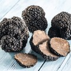

+++
title = "Trüffel Website"
date = "2021-08-31"
draft = false
pinned = false
image = "trueffel-2-1-.jpg"
description = "Wir beschäftigten uns heute mit dem gestalten der Website für die Trüffel. Unsere Ideen wurden erstmals auf einem Mindmap vermerkt."
+++

Da wir bereits eine Idee hatten wofür wir eine Website gestalten wollen, war der erste Schritt einfach für uns. Wir haben ein Brainstorming gemacht und haben viele Ideen gesammelt für die Website. Diese Ideen haben wir uns in unserem Team gespeichert. Wir hatten Glück denn Eliane's Eltern waren erreichbar und haben uns von ihren Vorstellungen erzählt. Die Ideen beiderseits war identisch und so wurde uns alles klar.